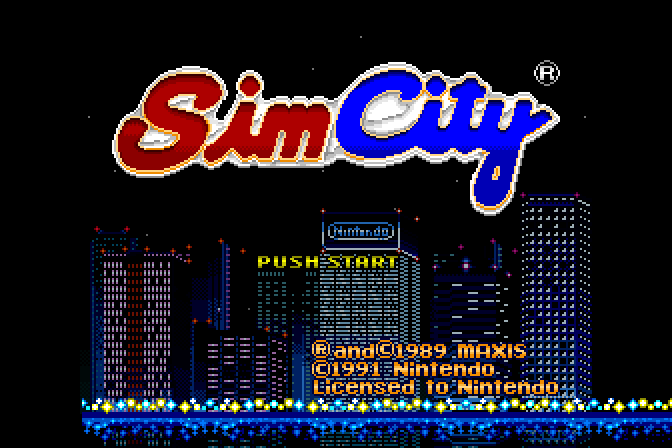
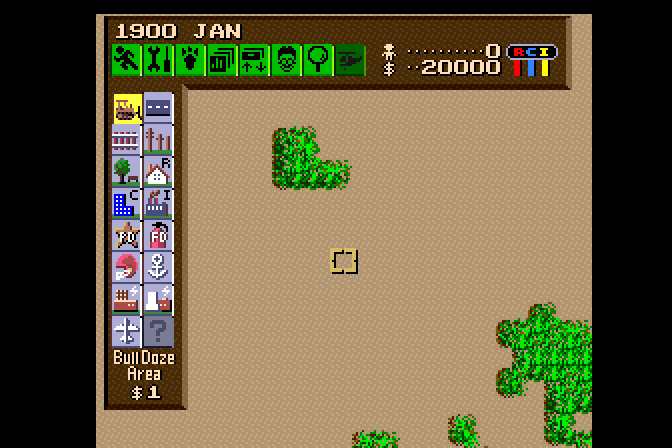

# SNES-SimCity-Recomp

Partial static recompilation of SimCity (SNES) for PC using [snesrecomp](https://github.com/RetroPortingToolKit/snesrecomp).

An unofficial, non-commercial project that recompiles the Super Nintendo game
**SimCity** (Nintendo, 1991) into C++17 for PC. All graphics, palettes, map data
and audio are read at runtime from a copy of the original ROM that **you**
supply; the ROM and any ripped assets are never included. Built on the
**snesrecomp** framework.

> ### How to read this file
>
> Every causal sentence below carries its state — **[MEASURED]** (an instrument
> observed it), **[INFERRED]** (deduced, not observed here), **[OPEN]** (asked,
> not answered) — or is a **retraction**, marked where the claim was made. The
> classification of *every* causal claim in this project, with the instrument
> behind it, is [`docs/CAUSE_CLAIMS.md`](docs/CAUSE_CLAIMS.md); the standard of
> proof is [`docs/DEFINITION_OF_DONE.md`](docs/DEFINITION_OF_DONE.md), whose Rule
> 0 is that **no criterion may be satisfied by a claim — only by a command that
> exits 0**.
>
> This project has retracted **22** claims (computed, `make retraction-count` —
> never a hand-written number). Where an old claim is quoted below it is
> labelled **RETRACTED** and is printed as history, not as the answer.

### How much of it is actually native

"Native recompilation" on its own oversells this, so the counts are given from
the generated manifest in the working tree
(`src/gen/program_manifest.json`; `src/gen/` is derived from your ROM and is
never committed):

| | measured |
|---|---|
| routines in the manifest | **302** |
| recompiled ahead of time (`aot_eligible`) | **239** |
| interpreter-only (`lle_only`) | **63**, holding **512 of 9 803** static instructions (**5.2%**) |
| distinct AOT symbols emitted into `src/gen/*.c` | **186** |

By function count this is roughly four-fifths native. By *time* it is not, and
the honest time figure is workload-dependent — it is stated per workload
below rather than as one number:

- **A live city executes ~7 214 interpreted opcodes per frame** (2 308 599
  steps over the 320-frame live window, banks 00+01 — measured on the Deck, see
  the instrument note below). The earlier figure of ~1 427 opcodes/frame was
  measured on **attract mode and menus** and is bounded to those.
- The bank-03 tick and the task dispatcher are **not** the whole story of what
  the interpreter runs; in a live city the interpreted time is dominated by the
  **vblank spinlock** (`$009311`/`$009313`/`$009315`, ~1 800 iterations/frame)
  plus the NMI handler once per frame.

Both counts are **[MEASURED]**, both are blind to AOT, and neither is a
measurement of *gameplay*: correctness is a separate question, and the snesrecomp
fork documents the relevant asymmetry — AOT code never advances the PPU beam
while the interpreter advances it every opcode, so a share of *time* is not
automatically a claim about behaviour.

## About the Game

**SimCity** is an open-ended city-building simulation created by **Will Wright**
and published by **Maxis** in 1989. You play as the mayor of an empty plot of
land: you zone residential, commercial and industrial areas, lay roads, power
and water, set taxes and a budget, and watch the simulation grow — or go broke.
Disasters (fires, floods, earthquakes, and a certain giant monster) keep you on
your toes.

The **Super Nintendo Entertainment System (SNES)** version was developed by
**Nintendo EAD** under license from Maxis and published by Nintendo in 1991
(JP April 26, NA August 23; EU September 24, 1992). It is widely regarded as
the best console adaptation of the original: seasons recolour the map, Nintendo
cameos appear (a Mario statue, a Bowser rampage), and extra scenario missions
were added. This port reproduces that SNES release.

## Status

**The city renders and it does not simulate. `make clock` is red and must stay
red.** One paragraph, because the rest of this section is the evidence:

| | state |
|---|---|
| ROM boots to attract, menus, naming | **working** [MEASURED] |
| A live city loads and is presented | **working** [MEASURED] — `$0B53 = 0x076C` (year 1900), `$0B55 = 1`, `$0B9D = 20000` |
| The vblank token handshake (a former deadlock) | **fixed** [MEASURED] |
| Date, population, treasury advance | **they do not** [MEASURED] — 34 WRAM bytes change across 2 599 frames of a live city |
| **Why the simulation does not advance** | **OPEN** — no cause is asserted anywhere in this repository |



⚠️ **Not deliverable.** The date stays `1900 JAN` forever — no month ever appears
across 6 000 frames, the seasons never recolour the map, the population stays 0 —
while the controller does nothing. `scripts/d_city.script` drives the game from
boot into a live city headlessly and deterministically, so this is **not** a
game-flow problem, and the renderer is proven live: poking a WRAM byte moves the
presented picture on the very next frame.



### What was fixed: the vblank token handshake

The game's vblank wait is a **token handshake**, not a flag test. ROM bytes,
bank 00, file offset `0x130F`. The mapper is **LoROM** — the SNES header sits at
`0x7FC0` and reads `SIMCITY`, and `0xFFC0` is filler; the linear rule this project
uses, `offset = bank*0x8000 + (addr & 0x7FFF)`, *is* the LoROM rule and is
byte-verified on two independent labels (several tracked documents call this
mapping "HiROM", which is wrong — see `docs/CONFLICTS.md` CONF-7). This ROM is
exactly 524 288 bytes with no copier header:

```
$00:930F  64 B9   STZ  $B9      $00:9311  E6 C7   INC  $C7
$00:9313  A5 B9   LDA  $B9      $00:9315  F0 FA   BEQ  $9311
$00:9317  60      RTS
```

The only writer of `$B9` is the NMI handler at `$00:80B2` (`INC $B9` at
`$00:80BC`). The host delivered NMI once at the top of the frame, **before** the
guest ran: the handler set `$B9 = 1`, the guest's `STZ $B9` then cleared it, and
the spin at `$9313` waited on zero forever. **[MEASURED]** — the handshake was
structurally impossible, not merely slow.

Two defects, both fixed in `afceeec`:

1. `recomp/bank00.cfg:44` carried `exclude_range 0x930D 0x9318` — a **missing
   `& 0x7FFF` mask**, so the range was compared against unmasked addresses, `STZ $B9`
   ran compiled inside `bank_00_930D_M0X0`, and the spinlock never yielded to the
   interpreter. Corrected to `0x130D 0x1318`.
2. `src/game_rtl.c:GameRunOneFrame` delivered NMI only at the top of the frame.
   It now delivers NMI **inside the slice loop after the guest parks**, plus a
   top-of-loop point armed for the case where the guest already burned the whole
   frame.

After the fix: `$00B9 = $01` at the frame boundary (it was `$00` in every prior
sample) and `$00C7` is counting. **[MEASURED]**, 5/5 samples. This is why the
vblank wait is no longer a candidate cause: fixing it left the city still not
simulating, so "the vblank handshake causes the freeze" is **RETRACTED**
(ledger R-005…R-008 territory; `docs/CAUSE_CLAIMS.md` C-012).

### What is not fixed, and what is actually measured about it

`$0B51` is the 16-bit master city tick counter (**[INFERRED]** — the role comes
from the reference implementation's trace, never measured here). `INC.w $0B51`
lives in bank 03 at ROM offset `0x18026` (`EE 51 0B`, SNES `$03:8026`).
**Bank 03 is where the tick is *believed* to live, and that belief is inferred
rather than measured.** What is measured is much narrower and much more
interesting:

- **Bank 03 executes.** 921 distinct PCs and 515 043 interpreted steps over
  frames 0–3700. **[MEASURED]**, on the Deck and on the dev host, to the unit.
  It is not code this build never reaches.
- **Bank 03 goes silent at f3271, not f3301.** The earlier boundary came from
  100-frame brackets, which could only see that the f3100–3300 bracket was
  non-empty. A per-frame stream puts the **last frame containing any bank-03
  execution at f3271** — 16 interpreted steps — with none in f3272–f3700, and
  the frame-for-frame pattern is identical on both machines. **[MEASURED]**.
  `docs/CAUSE_CLAIMS.md` C-039 is retracted as stated; C-039b replaces it.
- **Bank 03 only ever runs in `$03C63D`–`$03E57E`.** The whole `$038000`–`$03C63C`
  region executes **nothing** — and that region contains the tick. **[MEASURED]**,
  min/max of the full per-bank dump on both machines and in both instrument
  configurations.
- **`INC.w $0B51` at `$03:8026` executes zero times** — 0 hits in the 921-entry
  dump, 0 AOT block entries, both machines, f0–f3700, with `$0B51 = 0000` at
  f3600 in the same runs. **[MEASURED]**, C-041 answered. This is counted
  execution, not inference from a WRAM sample.
- **The AOT side is banks 00 and 01 too.** Whole-run AOT block log, first ever
  taken: 1 430 539 entries over f0–f3700, of which bank `$03` has **18**, all in
  f3270. In the live window f3400–f3700: `$00` and `$01` only. **[MEASURED,
  host-only]** — the Deck figure is not in this tree.
- **The city appears at ≈f3378, i.e. ≈107 frames *after* bank 03 falls silent.**
  This is a **correlation**, recorded as a correlation on purpose, because the
  next session will want to write it as a cause and the number is sitting there
  looking like evidence. **No cause is claimed for it.**

Whole-run per-bank histogram (Deck-native Release build with
`-DSNESRECOMP_INTERP_PROFILE`, 4 000 frames, rc=0). Cells are
`distinct PCs / interpreted steps`; the brackets partition exactly, to the unit:

| window | `$00` | `$01` | `$02` | `$03` | `$05` |
|---|---|---|---|---|---|
| boot 0–200 | 478 / 1 664 752 | 0 | 0 | 10 / 10 | 428 / 932 195 |
| attract 201–1200 | 494 / 5 336 356 | 575 / 5 411 938 | 542 / 601 366 | 499 / 11 035 | 392 / 328 481 |
| menus 1201–3380 | 1753 / 17 808 456 | 1231 / 56 967 | 0 | 532 / 503 998 | 191 / 250 260 |
| city 3381–3700 | 813 / 2 046 776 | 415 / 261 823 | 0 | **0 / 0** | 0 |
| **total 0–3700** | 1822 / 26 856 340 | 1814 / 5 730 728 | 542 / 601 366 | **921 / 515 043** | 956 / 1 510 936 |

Banks 04, 06 and 07: zero steps in every window above — **[MEASURED]**, and
bounded by that window.

> **Environment-fidelity caveat on every Deck number above and in every other
> document in this tree.** The Deck's SteamOS rootfs is damaged in a way pacman
> does not report: of the 504 paths `pacman -Ql glibc` claims under
> `/usr/include`, **503 are absent from disk** while `pacman -Q base-devel` still
> reports installed, and `echo '#include <stdio.h>' | gcc -E -` fails with
> `fatal error: stdio.h: No such file or directory`. The Deck build therefore
> resolves libc headers from a hand-assembled prefix at `/home/deck/sysroot`
> (headers from `archive.archlinux.org`) via `-idirafter`. **So: the Deck binary
> was compiled on the Deck, against a reconstructed header prefix, on a machine
> whose rootfs is damaged. A figure measured under those conditions describes
> those conditions.** This caveat travels with every Deck number cited anywhere.

Raw counts, both instruments, and what they cannot see:
[`docs/measurements/2026-10-02-c041-bank03-pc-dump.md`](docs/measurements/2026-10-02-c041-bank03-pc-dump.md).

### The open question, and what it is not

**Why does the city not simulate? [OPEN].** It is the only row in
`docs/CAUSE_CLAIMS.md` with no instrument, and no cause for it is asserted
anywhere in this tree.

**The question has changed shape, and the change is the finding.** The code that
was believed to advance the city clock is now *measured not to execute at all*.
So the open question is no longer "why does bank 03 stop at f3301" — bank 03
stops at f3271 and the reason is still unknown — but the sharper one:

> **What advances `$0B51` in the reference build, if not `$03:8026`?**

The premise underneath all of it, `$0B51` *is* the city tick, remains
**[INFERRED]** from the peer and has never been measured here. The next
measurement is therefore on the peer, not on this build: instrument
`Junior-Jones/SimCity-SNES-Static-Recomp` for the PC that writes `$0B51`, since
its API carries no PC or block trace today (C-032).

The retracted claims, each marked where it was made:

- **"The bank-03 tick is compiled to native C and still does not run"** —
  **RETRACTED 2026-10-02 (review finding R-03).** Bank 03 executed 515 043
  interpreted steps. The surviving, much narrower form is the f3301 boundary
  above, which is a location and not a cause.
- **"Therefore `INC.w $0B51` executes zero times"** — the *inference* was
  **withdrawn, not replaced** (review finding R-02; ledger R-020,
  `invalidated-premise`). Its premise (`$0012 == 0`) is false, and a refuted
  premise voids an inference and establishes **nothing in its place** — which is
  not a claim that it does run. The *conclusion* has since been reached by a
  different route and now stands on its own: **MEASURED**, zero executions on
  both tiers on both machines (C-041, C-008).
- **"The main loop does not run at all in a city"** — **RETRACTED as stated**,
  same measurement as R-03.
- **"The gate is `$0012`"** — **RETRACTED.** `$0012 = 0001` and `$0014 = 8000` at
  5/5 frame-boundary samples; its own stated evidence is what measurement refuted.
- **"The city does not load"** — **RETRACTED.** It does load; the runs behind that
  claim used a deliberately truncated `save.srm` from `scripts/clock-gate.sh`.
- **"Refusing to decode COP is the cause"** — **RETRACTED.** No word anywhere in
  the ROM points into `$038000–$038220`.
- **`CODE_008061` "never runs"** — **RETRACTED as stated.** It runs, at
  `$00:8061`, on both machines, immediately after bank 03's last `RTL`. It had
  sat at OPEN with the note "execution never measured", which is a fact about the
  instrument rather than about the world.

A 9 000-frame settle protocol on the Deck (162.5 s wall, real save
`24720bb57ff09426d588da564fea6c18`) read `1900/1` at **every** snapshot,
`$0BA5` = 0, `$0B9D` = 20 000, with 19–34 bytes changing per snapshot (0.02%).
**[MEASURED]** — a real save state does not advance the clock either.

### Where the record lives

This file is the entry point and is **not** the maintained record. Seven files
are:

| file | what it holds |
|---|---|
| [`docs/CAUSE_CLAIMS.md`](docs/CAUSE_CLAIMS.md) | every causal claim in this project, classified MEASURED / INFERRED / RETRACTED / OPEN, with the instrument or the reason there is none |
| [`docs/CONFLICTS.md`](docs/CONFLICTS.md) | every contradiction found between docs, code and git history, with the command that found it |
| [`docs/RE_CITY_FREEZE.md`](docs/RE_CITY_FREEZE.md) | the chronology — 44 entries, each with a state banner, and a maintained index at the top |
| [`docs/measurements/2026-10-02-deck-interp-histogram.md`](docs/measurements/2026-10-02-deck-interp-histogram.md) | the whole-run histogram this file's table reproduces, and the three instrument limits it established |
| [`docs/measurements/`](docs/measurements/) | raw measurements, the exact commands, and **what each instrument cannot see** |
| [`docs/CLAIMS_REGISTER.md`](docs/CLAIMS_REGISTER.md) | the index of what is retracted, superseded or unverified |
| [`docs/DEFINITION_OF_DONE.md`](docs/DEFINITION_OF_DONE.md) | the standard of proof — **no acceptance criterion may be satisfied by a claim** |
| [`docs/review/RUBRIC.md`](docs/review/RUBRIC.md) | the pre-registered review rubric (hash-pinned in `RUBRIC.sha256`) |
| [`docs/review/REVIEW-2026-10-02b.md`](docs/review/REVIEW-2026-10-02b.md) | the last full review — **REJECT, 3 BLOCKERs**, all since closed |
| [`docs/review/REVIEW-2026-10-02c.md`](docs/review/REVIEW-2026-10-02c.md) | the review of the C-041 work, and of this file's own gates |

## Gates

**Every figure names the machine and the date it was measured on.** A gate result
without a machine is not a measurement — see `docs/DEFINITION_OF_DONE.md` Rule 0.

Measured on the dev host `seyon` (i5-8500T, 6 threads, Ubuntu 24.04, gcc 13.3.0,
cmake 3.28.3) on 2026-10-02:

- Rows marked **8a7340f** were measured on that tree, before the README rewrite.
- Rows marked **4ba14c7** were re-measured after it. Two rows differ between the
  two trees and the difference is load, not code: `make perf` read median
  **54.50 fps, spread 9.6%** at `8a7340f` (load average 7.55 on 6 threads) and
  **53.68 fps, spread 5.6%** at `4ba14c7`. Every other row is identical, which is
  the useful part: the rewrite moved no number that a gate recomputes.

| command | what it proves | result | exit |
|---|---|---|---|
| `make build` | Release build | ok | 0 |
| `make test` | deterministic replay (ctest) | **2/2 passed** | 0 |
| `make test-rom` | the picture moves (frames 200–800) | **PASS, 257 distinct crc32** | 0 |
| `make perf` | gross frame-rate floor (5 × 600 frames) | **PASS, median 53.68 fps, spread 5.6%** (4ba14c7); 54.50 / 9.6% at 8a7340f | 0 |
| `make clock` | **the city actually simulates** | **FAIL — `1 distinct date images after f3600` (last change f3378 of 6000)**, `$0B53 = 076C` → year 1900 | **1** |
| `make check-claims` | no retracted claim asserted without a marker | PASS | 0 |
| `make check-causes` | every causal assertion carries provenance | **PASS** — after the fix at `HEAD`; it was **FAIL, exit 1**, from `8a7340f` until this commit, because the guard fired on the word "candi**date**" in its own header | 0 |
| `make check-causes-self-test` | the guard still fires on the tree it was written for | **PASS** — seeded against `9624f0e`, **3** unlabelled assertions | 0 |
| `make review-check-c041` | the C-041 review's claims reproduce | **PASS (bounded)** — counts printed by the gate itself; it refuses to total, and rubric **E-04 stays UNVERIFIED** | 0 |
| `make check-claims-self-test` | the ledger guard has been seen to fail | PASS | 0 |
| `make clock-self-test` | the clock detector still sees a live screen | PASS — 16 distinct date images over 1 200 frames | 0 |
| `make review-check` | the 2026-10-02 review's BLOCKERs are closed | **PASS** — 17 confirmed, 0 refuted; 3 ROM-dependent checks skipped (no `--rom`) | 0 |

**`make check-causes` was red for four commits and said so nowhere.** It fired on
the bare word `date` inside "candi**date**" on line 30 of its own header, so it
could never be green while that header stood — and the commit that added it
(`8a7340f`) said in its message and in DoD D3.7 that it was green. The fix is a
word boundary, which cannot lose a real match, and it was falsified three ways
before it was committed (revert the boundary → red again; a synthetic unlabelled
causal sentence still fires; the same sentence labelled `HYPOTHESIS` does not).
T094 carries the transcript. **The lesson is not the regex**: it is that a gate
added in the same commit as the claim it guards, and never run, shipped broken
and reported green.

**`make clock` is the one that matters and the one that is red.** It fails
identically on the Deck. It prints the guest's own year word as proof that a city
object exists, so it **cannot report PASS on a build that loads no city** —
verified by pointing it at a script that never reaches one, which it refuses with
a distinct "no city was loaded" verdict.

**The other gates pass while the game is a still image, and they pass for the same
reason each: they all measure before the city exists.** The first three inspect
frames 30–800 and are still on the attract screen and the menus.

**`make perf` is a floor, not a headroom figure.** It was reworked on
2026-10-02 to use the **median** of five runs plus a spread check, because
worst-of-N on a quantity whose noise is symmetric converts ordinary variance into
failures: the same unchanged binary previously flapped **48.38 FAIL / 51.52 PASS
/ 46.99 FAIL** against a threshold of 50. It still has a spread guard — over 10%
is `INCONCLUSIVE` (exit 2), not PASS — and the run measured above sat at 9.6%,
which is close enough to the guard to be worth stating: **that host had a load
average of 7.55 on 6 threads while the gate ran**, and run 5 of 5 fell to 49.66
fps. On the Deck, the five runs of the **previous** worst-of-5 method finished in
exactly 10.549 s — to the millisecond, five times — so Deck pacing is frame-locked
and that gate could not detect guest slowdown there at all.

### Performance

`make perf` measures it and fails on a regression. Numbers, same ROM, 600
frames:

| Machine | Build | fps | `guest` ms/frame | `upload-present` ms/frame |
|---|---|---|---|---|
| Steam Deck (Zen 2), **compiled on the Deck** — *environment-fidelity caveat above* | Release | 56.88 | **4.502** | **1.007** |
| i5-8500T, built in place | Release | 54.50 median (5 runs) | 6.62–10.82 | — |
| i5-8500T, cross-built binary | Debug (`-O0`) | 42.4 | 9.52 | 5.90 |

**Three claims about this table were retracted, and the reasons are instructive.**

- The Deck row's `2.45` ms was **never re-measured** and is ledger **R-012/R-021**.
  The measured Deck figure is **4.502 ms**. The old row also claimed
  `upload-present` **8.13 ms**, measured on the Deck at **1.007 ms** — the
  opposite side of the guest by a factor of four and a half.
- **"The emulated 65816 is not the bottleneck"** is **RETRACTED** (ledger R-023,
  R-025). It rested on `guest` being 2.45 ms against a large `upload-present`.
  Measured on the Deck the picture is the reverse: guest 4.502, upload-present
  1.007, **deadline-wait 11.275** — **pacing dominates, not the CPU** [MEASURED,
  Deck].
- The **"upload-present costs 6.8× the guest"** figure that replaced it was an
  artifact of `SDL_VIDEODRIVER=dummy` **on the dev host**, not a property of the
  code. Neither number survives.
- The `-O0` row (42.4 fps) is the one part that still stands, and it is why
  `make build` ships Release.

The per-stage split comes from `SNESRECOMP_HOST_PROFILE=1`, which writes
`video profile: stage=...` lines into `last_run_report.json`. `guest` is the
emulated CPU; `upload-present` is the host's present path. They are different
costs with different owners.

A healthy build is vsync-capped at 60 fps and so has **no headroom visible in the
fps figure at all** — faster hardware would not move it. `guest` ms/frame is the
number that shows headroom.

## Requirements

### Any Linux (Debian/Ubuntu, Fedora, Arch, SteamOS)

- `base-devel` equivalent — a C/C++ toolchain and `make`:
  **Debian/Ubuntu** `build-essential`; **Arch/SteamOS** `base-devel`
- **`cmake`** ≥ 3.20 (measured: 3.28.3 on Ubuntu 24.04, 4.0.3 on the Deck)
- **`git`** — the `snesrecomp` submodule is required
- **`pkgconf`** (`pkg-config` on Debian/Ubuntu) — SDL3's configure probes it

**No SDL package is needed.** `snesrecomp/runner/runner.cmake` looks for an SDL3
package, finds none, and **fetches and builds SDL 3.4.10 from source, static**
(`SNESRECOMP_SDL3_FETCH=ON`, tarball hash-pinned). Pass
`-DSNESRECOMP_SDL3_FETCH=OFF` to require an installed SDL3 instead.

**`libxtst-dev` is not needed** as long as `-DSDL_X11_XTEST=OFF` is passed, which
`make build` already does. Without it a clean build directory stops with
`Couldn't find dependency package for XTEST`, because SDL3 enables XTEST — its
synthetic-input extension — by default and nothing here uses it.

For a **windowed** build on X11, the SDL3 configure additionally resolves the
X11, Xcursor, Xrandr, XInput, XFixes, Wayland, EGL/GL, ALSA, libudev and D-Bus
development packages through `pkg-config`. All of them were present on the dev
host (measured: `x11 1.8.7`, `xext 1.3.4`, `xcursor 1.2.1`, `xrandr 1.5.2`,
`xi 1.8.1`, `xfixes 6.0.0`, `wayland-client 1.22.0`, `egl 1.5`, `gl 1.2`,
`alsa 1.2.11`, `libudev 255`, `dbus-1 1.14.10`). The headless configuration
below needs **none** of them.

### SteamOS / Arch, and the damaged-rootfs caveat

Measured on the Deck on 2026-10-02: `base-devel 1-2`, `cmake 4.0.3-1`,
`git 2.50.1-3`, `pkgconf 2.5.1-1` — and that is the whole dependency list for the
headless build. `libxtst-dev` is **not** installed and not needed.

⚠️ **The Deck's rootfs is damaged in a way pacman does not report.** `pacman -Q
base-devel` and `pacman -Ql glibc` both report success, but **503 of the 504
paths pacman claims under `/usr/include` are absent from disk**, and

```
$ echo '#include <stdio.h>' | gcc -E -
<stdin>:1:10: fatal error: stdio.h: No such file or directory
compilation terminated.
```

(`gcc -x c -E -` fails identically; only the *file* `/usr/include` directory entry
itself still exists.) There is no sudo and no cached glibc, so it cannot be
repaired there. The Deck build works around it with a hand-assembled header
prefix at `/home/deck/sysroot` and `-idirafter` — deliberately **not**
`-isystem`, which sorts *before* `/usr/include` and breaks libstdc++'s
`#include_next <stdlib.h>`. **Every Deck number in this repository inherits that
caveat.**

### macOS / Windows

Not measured on either; the framework carries the paths and nothing in this
repository has been verified on them. Treat this section as untested rather than
as support.

### The ROM

`SimCity (USA).sfc`, **user-supplied and never committed**. MD5
`23715fc7ef700b3999384d5be20f4db5`, exactly **524 288 bytes**; `rom_identity.txt`
carries the digests and the build turns them into `snesrecomp_rom_identity.h`.
`git ls-files | grep -ci '\.sfc$'` must be `0`.

## Building

`build/` is **not** committed — it holds a full SDL3 build and no binary belongs
in the repository.

```bash
git clone --recurse-submodules https://github.com/linuxkafe/SNES-SimCity-Recomp
cd SNES-SimCity-Recomp
make build
```

`make build` is Release (`-DCMAKE_BUILD_TYPE=Release`) and already passes
`-DSDL_X11_XTEST=OFF`; by hand that is:

```bash
cmake -S . -B build -DCMAKE_BUILD_TYPE=Release -DSDL_X11_XTEST=OFF
cmake --build build --parallel
```

`make debug` is the same with `-O0`. The two were proven byte-identical on the
guest before the default changed — same 128 KB WRAM image and same presented-crc32
column across attract, menu and naming at 3 000 frames, with cartridge SRAM
pinned cold on both sides. **That equivalence is proven for those paths, not for
all time and all input**, so keep `test_deterministic_replay` in the loop if you
switch back and forth.

### Headless build (no X11, no Wayland)

For a machine with no display server, or one whose window-system headers are
missing, add:

```bash
-DSDL_X11_XTEST=OFF \      # no libxtst-dev: XTEST is unused (synthetic input)
-DSDL_X11=OFF \            # no X11 headers/libs: no window on this machine
-DSDL_WAYLAND=OFF \        # no wayland-protocols / wayland-scanner
-DSDL_UNIX_CONSOLE_BUILD=ON # console (not launcherd) SDL backend on Unix
-DOPENGL_INCLUDE_DIR=/path/to/your/reconstructed/usr/include \  # e.g. /home/deck/sysroot/usr/include
-DOpenGL_GL_PREFERENCE=LEGACY  # GL headers shipped for this box, not the newest profile
```

`SDL_UNIX_CONSOLE_BUILD=ON`, `OPENGL_INCLUDE_DIR` and `OpenGL_GL_PREFERENCE=LEGACY`
are the three the Deck needed *in addition* to the display-system switches, and
they are the ones whose reason is a property of the machine rather than of this
project. On an intact Linux box the first four are enough; the last two are for
the damaged-rootfs case above.

Note: the `snesrecomp` submodule is pinned to a small fork
(`linuxkafe/snesrecomp`) with the SimCity host runtime additions
(debug/watchdog globals, recomp stack depth).

### Running it

Then run with your own `SimCity (USA).sfc`, **by absolute path**: the host chdirs
to the executable directory, so a bare relative filename resolves there, not in
your shell's working directory.

```bash
./build/SimCitySNESRecomp "$PWD/SimCity (USA).sfc"
```

## Running

```bash
# Resolution presets — pin the window to a fixed display size
SNESRECOMP_RESOLUTION=720p ./build/SimCitySNESRecomp "$PWD/SimCity (USA).sfc"   # 1280x720
SNESRECOMP_RESOLUTION=800p ./build/SimCitySNESRecomp "$PWD/SimCity (USA).sfc"   # 1280x800
SNESRECOMP_RESOLUTION=1080p ./build/SimCitySNESRecomp "$PWD/SimCity (USA).sfc"  # 1920x1080
SNESRECOMP_RESOLUTION=2560x1440 ./build/SimCitySNESRecomp "$PWD/SimCity (USA).sfc"  # raw WxH also works

# Headless
SDL_VIDEODRIVER=dummy SDL_AUDIODRIVER=dummy ./build/SimCitySNESRecomp "$PWD/SimCity (USA).sfc"

# SNES Mouse on player 2 (opt-in; host cursor hidden, guest cursor takes over)
SNESRECOMP_MOUSE=1 ./build/SimCitySNESRecomp "$PWD/SimCity (USA).sfc"

# Input diagnostics — manual+auto read depth, auto word seen by the guest
SNESRECOMP_MOUSE=1 SNESRECOMP_PAD_PROBE=1 ./build/SimCitySNESRecomp "$PWD/SimCity (USA).sfc"
```

## Controls

All defaults below; every binding is rebindable through a `keybinds.ini`
`[KeyMap]` beside the executable (dump what a build resolved with
`SNESRECOMP_KEYMAP_DUMP=1`).

**Quick save / load** (10 slots)
- `F1`–`F10` — quick **load** slot 1–10
- `Shift+F1`–`Shift+F10` — quick **save** slot 1–10
- `F11` — save-state menu (thumbnail browser)
- `F12` — rewind filmstrip (≈60 snapshots, ~6 s of history)
- Controller: **Select + R** opens the save-state menu

**Time and speed**
- `Tab` — **turbo**: run the simulation as fast as the machine allows and
  render every 16th frame (use to fast-forward a growing city)
- `P` / `Shift+P` — pause (paused screen dimmed/not)

**Other**
- `Ctrl+R` — reset
- `Alt+Enter` — fullscreen toggle
- `Alt+W` — widescreen toggle
- `F` — display performance readout
- `Keypad +` / `Keypad −` — volume up/down

Save-state slots are stored as `saves/save1.sav` … `saves/save10.sav` in the
`saves/` directory beside the executable; battery SRAM (the in-game "SAVE" /
"LOAD" menus) uses `saves/save.srm`.

## Mod Support

The recompiled core stays **byte-deterministic**: acceleration or save/load
only changes *how many* simulated frames run or when the timeline jumps —
never the state of any single frame.

**Built-in QoL toggles** (environment variables, off by default):
- `SIMCITY_WIDESCREEN=1` — widen the isometric view (336 px frame)
- `SIMCITY_GODMODE=1` — infinite money, instant build
- `SIMCITY_DISASTER_TOGGLE=1` — disable disasters; `=2` force random ones

```bash
SIMCITY_GODMODE=1 ./build/SimCitySNESRecomp "$PWD/SimCity (USA).sfc"
```

**Mod packages (`.snesmod`)**: the framework's package loader is enabled and
stages `mods/preloaded/packages/` beside the executable; a launcher Mods page
installs and uninstalls packages. This port ships **no** packages by default
(its own mods are the `SIMCITY_*` toggles above). The package format is
documented in the framework at `snesrecomp/docs/MOD_PACKAGES.md`.

## Debug Flags

- `SIMCITY_DEBUG_WATCHDOG=1` — watchdog handler with CPU state dump
- `SIMCITY_DEBUG_DMA=1` — DMA transfer logging with source validation
- `SIMCITY_DEBUG_APU=1` — APU sync timing logs
- `SNESRECOMP_HOST_PROFILE=1` — per-stage host cost (`guest`, `upload-present`,
  `deadline-wait`) into `last_run_report.json`

### Instruments, and three traps in them

The three facts below are the most transferable result in this repository, and
every one of them cost a wrong conclusion first. They are here so the next
session does not pay for them again.

1. **`CYC_WATCH` is blind to AOT.** Its hook,
   `snesrecomp/runner/src/snes/interp_bridge.c:2034`, sits inside
   `_interp_run_core` (`:1009`), the per-interpreted-opcode loop, and compares
   against `pc_before`; the AOT side lives in `cpu_trace_block`, which is a
   **no-op** unless `SNESRECOMP_TRACE=1`
   (`snesrecomp/runner/src/cpu_trace.h:1316`) — the default is off.
   Blindness test: `CYC_WATCH=1C700-1C7FF` logged 28 002
   hits, all in f3094–f3103, and **zero** in f3400–f3410, while `AOTBLK=3400-3410`
   logged 11 267 entries at overlapping PCs in exactly those frames.
   **A zero from `CYC_WATCH` proves nothing about AOT execution.**
2. **`AOTBLK` was never mute — it takes a frame window, not a PC range.**
   `snesrecomp/runner/src/cpu_trace.c:1244` `sscanf`s `"%ld-%ld"` against
   `snes_frame_counter`; `CYC_WATCH` (`interp_bridge.c:2036`) `sscanf`s
   `"%lx-%lx"` against `pc_before`. Passing `38000-381FF` asked for frames
   38000–381FF.
3. **`SNESRECOMP_INTERP_PROFILE` was exposed by no CMake option**, which is why
   the interpreted histogram had never been run in a normal build. Configure with
   `-DCMAKE_C_FLAGS="-DSNESRECOMP_INTERP_PROFILE=1"`. Note also that its
   `[interp_profile] … top 60 by host-ms` list prints **nothing** unless
   `SNESRECOMP_INTERP_MS_PROF=1` is set: without it every entry's `ms` is `0.0`
   and the leading sort slots are unused hash-table entries.
   **A section header with no rows under it is not a negative result.**

4. **Every AOT-side instrument is unreachable from a default build.**
   `SNESRECOMP_AOTBLK="lo-hi"` over 4 000 frames logged **zero** lines and no
   warning: `cpu_trace_block()` is an empty `static inline` unless
   `SNESRECOMP_TRACE=1`, and with that define the link fails on 24 undefined
   references into `debug_server.c`, which no CMake option in this repository
   added. A knob that accepts its variable and prints nothing is worse than one
   that is absent. `-DSNESRECOMP_TRACE_BUILD=ON` (default **off**) now adds
   `debug_server.c` and links pthreads, which is what makes trap 4 avoidable.

Two knobs were added for this, dev-only behind `-DSNESRECOMP_INTERP_PROFILE`:
`SNESRECOMP_INTERP_DUMP_BANK=03` prints **every** distinct PC in one bank with
its step count (the top-60 list cannot answer "is this one address among
them"), and `SNESRECOMP_INTERP_TRACE_FRAMES=lo-hi` prints every interpreted PC
in a frame window, all banks, in execution order.

**One caveat about the histogram itself, measured:** instrumentation overhead
moves it. The same binary, ROM, script and window give bank 03 = 921 PCs /
515 043 steps plain and 946 PCs / 515 337 steps with the trace compiled in — even
with a window in which it prints nothing. **The PC histogram is a property of an
instrumented build, not of the game** (C-048, cause OPEN). Distinct-PC counts are
stable across machines and runs; *step* counts are not, in the spinlock-dominated
banks: `$00` measured 26 856 340 and 28 769 361 steps across two runs of one
binary (C-049).

## Architecture

```
src/
├── main.c              # Host entry, presenter callbacks, config
├── game_rtl.c          # Frame loop, NMI/IRQ, VBlank wait
├── gen_stubs.c         # Mod hooks (GodMode, disasters)
└── gen/                # Generated by snesrecomp (gitignored)
    └── bank*_v2.c      # Recompiled 65C816 → C
recomp/
├── bank00.cfg          # Bank 0 config with force_lle
├── bank01-07.cfg       # Bank configs
└── funcs.h             # Function declarations (auto-synced)
```

## Legal & Attribution

This is an **unofficial, fan-made project**. It is **not affiliated with,
sponsored by, or endorsed by Nintendo, Electronic Arts, or Maxis.**

- **SimCity®** and the SimCity logo are registered trademarks of
  **Electronic Arts Inc.** SimCity was originally created by **Will Wright**
  and published by **Maxis** (1989); the SNES version was developed by
  **Nintendo EAD** under license from Maxis and published by **Nintendo**
  (1991). All game code, graphics, audio and other assets are © their
  respective owners (Maxis / Electronic Arts / Nintendo).
- **Super Nintendo Entertainment System**, **SNES** and **Super Famicom** are
  trademarks of **Nintendo**.
- **ROM not included** — you must legally own and supply your own
  `SimCity (USA).sfc`. No copyrighted ROM, ripped tiles, palettes or audio are
  committed to this repository.
- Published binaries contain recompiled 65C816→C code **derived from your
  ROM**; the ROM image itself is never committed or distributed.
- This project does not circumvent copy protection and is offered for
  **non-commercial** preservation and research use.
- Project license: **PolyForm Noncommercial 1.0.0** — non-commercial use only.
- snesrecomp framework: PolyForm Noncommercial 1.0.0, copyright © 2026 Matthew
  Stanley. The runner statically links MIT/ISC third-party components
  (snesrev's zelda3/smw ports, LakeSnes, ares-derived coprocessor cores);
  the required license notices ship with every distributed build in
  [`THIRD_PARTY_ATTRIBUTION.md`](THIRD_PARTY_ATTRIBUTION.md).

## Peer study

`study/peer-linux/` builds the reference recomp on Linux and gives it a window.

```bash
study/peer-linux/build-peer-linux.sh                    # build, then play
study/peer-linux/build-peer-linux.sh --headless         # measure instead
study/peer-linux/build-peer-linux.sh -- --date --wram 300   # pass options through
```

The peer ships a Windows-only launcher; on Linux its CMake omits the frontend and
builds just the core, so a frontend is required. `jjwin.c` is ours and talks to
the peer's public C API. Its repository declares no licence, so this is private
study: do not publish or redistribute it. A keyboard reaches a city on its own —
the naming screen's cursor walks on the d-pad and **B** confirms from a character
key. See `study/peer-linux/README.md`.

**What comparing against it proved, and what it did not.** The peer recompiles
the same ROM and its clock runs — 23 months across 33 700 frames. Both cores were
traced at 100-frame intervals and diffed. The arithmetic on our side is
measured (`$0B51 = 0000` at every sample from f3150 to f30000); the *role* of
`$0B51` is **[INFERRED]** from the peer and has never been measured here; and the
comparison has **not** established where control fails to reach the tick routine.
Do not read the peer's working clock as a measurement of ours.

## Development

```bash
# Regenerate from ROM
bash tools/regen.sh "SimCity (USA).sfc"

# Run tests
cd build && ctest --output-on-failure

# Deterministic replay test
SIMCITY_DEBUG_WATCHDOG=1 SIMCITY_DEBUG_APU=1 \
  SDL_VIDEODRIVER=dummy SDL_AUDIODRIVER=dummy \
  timeout 30 ./build/SimCitySNESRecomp --script tests/deterministic_replay.script "$PWD/SimCity (USA).sfc"
```

## Feature Status

| Feature | Status |
|---------|--------|
| Core recompilation (recompiled 65816 drives the PPU) | ✅ Done |
| Runtime stability | ✅ Done (10k+ frames) |
| Title screen | ✅ Working |
| Native widescreen (336 px, game-native renderer) | ✅ Done |
| Game-native graphics (terrain, buildings, font) | ✅ Working (verified interactively) |
| Headless capture | ✅ Fixed (T039) — `make test-rom` gates it |
| AOT compilation of declared functions | ✅ Done (239 `aot_eligible` nodes in the current manifest) |
| Config bar over the game | ✅ Done (T054) |
| SNES Mouse on player 2 (`SNESRECOMP_MOUSE=1`, bsnes-exact protocol) | ✅ Device-level done (T042, ROM-free verified) |
| Resolution presets (720p/800p/1080p, `SNESRECOMP_RESOLUTION`) | ✅ Done (T041) |
| Quick save/load (10 slots), save-state menu, rewind, turbo | ✅ Working |
| **City simulation runs (date, population, treasury advance)** | ❌ **`make clock` is red; the city view loads and then zero simulation ticks run — cause [OPEN]** |
| Scenarios (all 5 US) | ⏳ T011 — confirm ENT step is the gate (see `docs/RE_SCENARIO_NAV.md` step 10) |
| Building/visual verification (headless capture) | 🔄 T033 — unblocked by T039 |

The city view renders correctly and the frame loop runs once per frame
throughout; the game state never leaves its initial values, so the date,
population and treasury never change. **The cause is OPEN** — see
[`docs/CAUSE_CLAIMS.md`](docs/CAUSE_CLAIMS.md) node C-006. (An earlier version of
this file pointed at `aes/tickets/T058-city-clock-does-not-advance.md`. `aes/` is
gitignored **permanently and by rule** — DoD D4.3 — so that path resolves in no
fresh clone. Pointing a tracked file into an uncommittable directory is the same
rule breaking itself; the pointer now names a tracked file.)

## License

PolyForm Noncommercial 1.0.0 - See [LICENSE](LICENSE) for details.

### Widescreen (16:9)

`Widescreen = 1` is a per-title PPU contract and does nothing here, for a
reason worth stating plainly: SimCity draws a fixed 256 columns, and the
`frame_width` of 336 is 256 plus 40 blank pixels per side. Nothing renders past
column 256, so the margins are empty by construction - a PPU-side 16:9 would be
71 blank pixels per side instead.

What works is 16:9 as a **presentation**: the authentic 256-wide picture
stretched to 16:9, filling the window edge to edge with no bars.

```ini
[Graphics]
DisplayAspect=16:9
```

The default is unchanged. The toggle key cycles 4:3 <-> 16:9.

Presentation only, and the precise claim is narrower than "identical": in 16:9
the PPU frame is 256 wide instead of 336, so the **presented framebuffer is a
different width** and will not hash equal to the 4:3 one. What is identical is
the guest's own 256 columns - cross-platform checked on two machines, where the
256 columns inside the margins hash equal to the whole 16:9 framebuffer, and the
margins are solid black. An earlier version of this file said "byte-identical
either way" and was wrong; see `docs/RE_CITY_FREEZE.md`.
