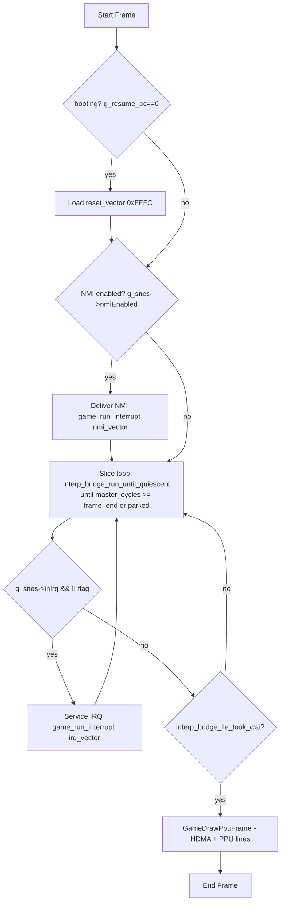
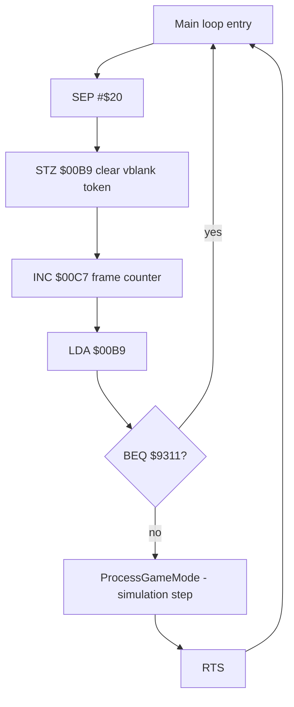

# SimCity SNES Recomp – Host/Guest Loop Model

## Host frame loop – src/game_rtl.c GameRunOneFrame

Key invariants from `src/game_rtl.c`:
* One NTSC frame = `357368` master cycles.
* NMI delivered at vblank edge gated on `NMITIMEN`.
* Resume PC `g_resume_pc` is host state, saved/loaded via `SimCityStateSaveExtra/LoadExtra`.
* NMI preserve regs active by default `SNESRECOMP_NMI_PRESERVE_S=1` to avoid stack relocation bug T050.

## Guest main vblank wait – $930D

NMI handler sets token `INC $00B9` – early exit branch $80B2/$80BC. Token is the vblank handshake.

## What is NOT in the loop — the open question

This diagram above is the *host* and the *vblank handshake*, both measured and
both correct. What it does not contain is the **simulation tick**: the routine
that advances the month, the season and the population.

MEASURED, over 3600 city frames:

* The per-frame city dispatcher is `$01:894A`, and it runs — 221 executions.
  It is not the simulation; it is the frame's top level.
* Its body dispatches a state machine through `$01:88EF` and calls raster/HDMA
  setup. Of 110 body addresses, 85 write byte-identical values across 10
  frames; the 25 that vary are raster position, loop index and stack. **The
  control flow never varies.**
* **Banks 02, 03 and 05 all execute** (1.9%, 1.4%, 2.4% of interpreter
  samples). An earlier claim in `RE_CITY_FREEZE.md` that they never run is
  wrong. Banks 04, 06 and 07 are genuinely at zero — and those are data.
* The city map is **battery SRAM**, not WRAM: `$01:F8E9` (`LDA $7F0200,X`) runs
  78,392 times, `$01:F8AF` 12,403, and `save.srm` grows 0 -> 32,768 bytes during
  a run. So "cold battery" describes the first frame only.
* `$03:8B42` — the only thing that could set `$0BB9` per frame — executes
  **zero** times, and does not appear in `src/gen/program_manifest.json` at all.
* Two gates are proven and both belong to the **display-table rebuild** path
  (`$00:84AD`, `$00:85EC` copy from the `$0B00` page into `$7E2021` and
  `$7E38EE`), *not* to a simulation. `$00:85EC` is refused every frame by
  `$D7 == 1`; on the live city `$D7 == 0`.

**The month/season/population routine has not been located.** Clean negative:
no ASCII `1900` or month name in WRAM (they are tiles), no 12-entry table in
the ROM (764 hits, all sliding windows over value ramps), and no date-shaped
cluster in `$0400-$04FF` — `$0406` has exactly four references in the whole
ROM. See `docs/RE_CITY_FREEZE.md` for the full negative result.

## The gate

`make clock` is the gate for this, and it is **FAIL**. It samples the HUD date
passively, which is also why an earlier reading of "1 distinct crc32" was
misread as a frozen renderer — the renderer responds to input within one frame
(`pokefor $0B9D` moves the presented picture on the next present). The date is
the right thing to assert; the sample method is passive by design.
