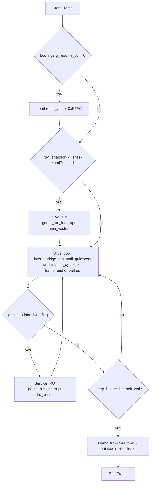
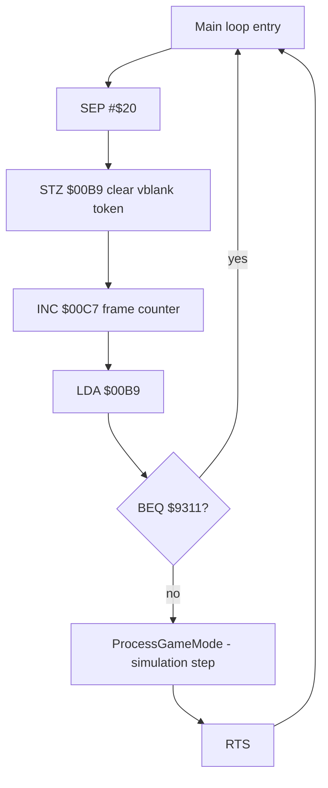

# SimCity SNES Recomp – Host/Guest Loop Model

## Host frame loop – src/game_rtl.c GameRunOneFrame

Key invariants from `src/game_rtl.c`:
* One NTSC frame = `357368` master cycles.
* NMI delivered at vblank edge gated on `NMITIMEN`.
* Resume PC `g_resume_pc` is host state, saved/loaded via `SimCityStateSaveExtra/LoadExtra`.
* NMI preserve regs active by default `SNESRECOMP_NMI_PRESERVE_S=1` to avoid stack relocation bug T050.

## Guest main vblank wait – $930D

NMI handler sets token `INC $00B9` – early exit branch $80B2/$80BC. Token is the vblank handshake.

## Current problem

* City loads, animation runs, date stays 1900 JAN.
* Measured on Steam Deck headless: 60.03 fps, guest 2.45 ms/frame, WRAM changes 193 bytes over 600 frames.
* Live city clock not verified on Deck; requires `scripts/d_city.script` + HUD date crop verification.

See `docs/RE_CITY_FREEZE.md` for full hostile analysis and measurement history.
